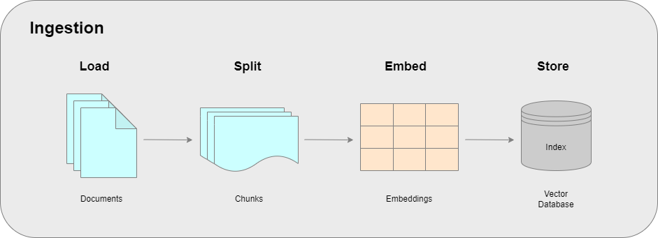

# RAG-Ingestion
This repository contains a Jupyter notebook experimenting the data ingestion pipeline for a retrieval augmented generation (RAG) system. It contains basic code for data loading, data splitting, creating embeddings, and storing data in a vector store.

